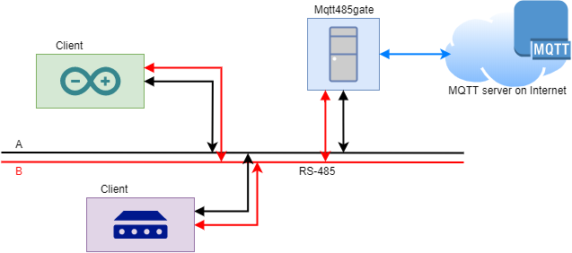

# Mqtt485

Simplified MQTT client designed for RS-485.

This library implements client of simplified protocol based on MQTT for messaging from devices with RS-485 serial port. It uses a low-level protocol [Simple485](https://github.com/rzeman9/Simple485).

Clients need gate to forward traffic to full MQTT server or process in another way. See [pyMqtt485gate](https://github.com/rzeman9/pyMqtt485gate).

### Features

- subscribing and unsubscribing topics
- publishing
- no QoS, retained, ...

## Basic Usage

**Requires:** [Simple485](https://github.com/rzeman9/Simple485) (low-level protocol)

```c++
Simple485 rs485;
Mqtt485 mqtt485;

void onMessage(String topic, uint8_t len, uint8_t * bytes) {
  Serial.println("Received " + String(len+1) + " bytes in topic " + topic + ":");
  Serial.write(bytes, len);
  Serial.println("");
  delete [] bytes;  
}

rs485 = Simple485(&Serial, addr);
mqtt485 = Mqtt485(&rs485, gateaddr, &onMessage);

mqtt485.subscribe("subscription_topic");
mqtt485.publish("output", "hello");

rs485.loop();
while (rs485.received() > 0) {
  Message m = rs485.read();
  mqtt485.receive(m.len, m.bytes);
}
```



## Library Description

- `Mqtt485(Simple485 * rs485, uint8_t gateaddr, void(*onMessage)(String topic, uint8_t len, uint8_t * bytes))` constructor, `rs485` instance of Simple485, `gateaddr` address of Mqtt485gate, `onMessage` callback
- `void publish(String topic, uint8_t len, uint8_t * bytes)` publish `len` of `bytes` to topic
- `void publish(String topic, String message)` publish string to topic
- `void subscribe(String topic)` subscribe topic
- `void unsubscribe(String topic)` unsubscribe topic
- `void receive(uint8_t len, uint8_t * bytes)` process incoming packet from Simple485